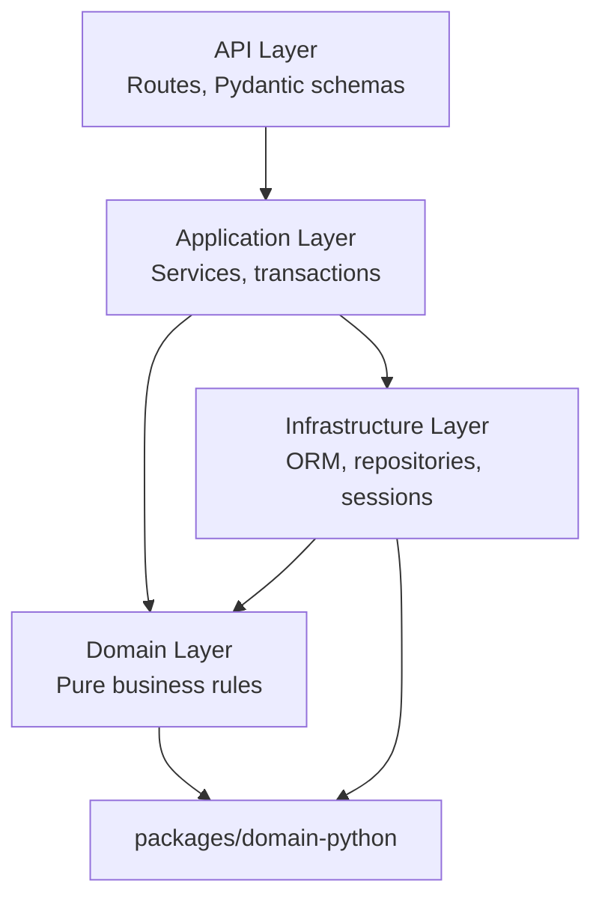

# ChronoArb — Backend Development Continuation & Ownership Handoff

**Document type:** Backend ownership transfer
**Date:** 2026-08-03T22:16:40+05:00
**From:** Lead Software Architect
**To:** Incoming Backend Developer
**Status:** Current

---

## 1. Purpose of This Handoff

This document transfers ownership of the ChronoArb backend implementation from the current architect to the incoming backend developer. The current developer transitions to frontend implementation (Next.js dashboard, Flutter mobile) while the backend developer owns all server-side work from this point forward.

**Key responsibilities after this handoff:**

| Role | Owns |
|------|------|
| Backend developer | `apps/api/`, `apps/worker/`, `packages/domain-python/`, `packages/source-adapters/`, database migrations, API routes, backend tests |
| Frontend developer | `apps/web/`, `apps/mobile/`, `packages/design-tokens/`, `packages/api-client-ts/`, `packages/api-client-dart/` |
| **Both must coordinate on** | `main` branch stability, shared config (`pyproject.toml`, `turbo.json`), API contracts, authentication design, database schema changes |

**Rule:** `main` is the shared stable integration branch. No force pushes. No rewriting shared history. Coordinate breaking changes before merge.

---

## 2. Verified Starting Point

The following baseline is verified as of 2026-08-03T22:16:40+05:00. Every value below was confirmed against the repository.

| Check | Value | Verification Method |
|-------|-------|--------------------|
| Architecture foundation | Complete | `docs/architecture/*.md` — all 7 documents |
| Repository foundation | Complete | Package registry files present, monorepo operational |
| Backend foundation | Complete | FastAPI app serves `/health`, `/ready` |
| Database foundation | Complete | `make db-reset` produces 25 tables |
| Week 2 Phase 1 | **Closed** | `docs/reviews/week-02-phase-01-closure.md` |
| Week 2 Phase 2 | **Closed** | `docs/reviews/week-02-phase-02-review.md` |
| PostgreSQL tables | 25 | `\dt` — all 25 user tables + alembic_version |
| ENUM types | 7 | `SELECT typname FROM pg_type WHERE typtype='e'` |
| Application indexes | 12 | `\di idx_*` |
| Alembic migrations | 4 | `alembic/versions/` — 4 files |
| Migration head | `f2b39ba97b17` | `SELECT version_num FROM alembic_version` |
| Revision chain | `a40b5bfef9a2` → `12e1f9e711d2` → `de4e1b0ff4a3` → `f2b39ba97b17` | `alembic history` |
| API tests | 57 | `pytest apps/api/tests/ --collect-only` |
| Domain tests | 33 | `pytest packages/domain-python/tests/ --collect-only` |
| **Total tests** | **90** | Both suites |
| Git branch | `main` | `git branch --show-current` |
| Latest commit | `a1d1e3f` — onboarding guide | `git log --oneline -1` |

### Baseline Tag Recommendation

After reviewing this document, create a tag on `main`:

```bash
git tag -a week2-phase2-closed -m "Week 2 Phase 2 closure — 90 tests, 25 tables, 4 migrations"
git push origin week2-phase2-closed
```

---

## 3. Backend Ownership Boundary

### Backend Developer Owns

```
apps/api/apps/api/          # FastAPI application and all modules
apps/api/apps/api/*/infrastructure/  # ORM models, repositories
apps/api/apps/api/*/application/     # Services (when implemented)
apps/api/apps/api/*/api/             # Routes, Pydantic schemas
apps/api/tests/             # Backend tests
apps/worker/                # Worker process implementations
packages/domain-python/     # Domain value objects, policies, protocols
packages/source-adapters/   # Source-specific fetch/parse adapters
alembic/                    # Database migration files
alembic.ini                 # Alembic configuration
Makefile                    # Database commands (db-reset, db-status, etc.)
docs/architecture/          # Backend architecture documentation
docs/adr/                   # Architecture Decision Records
docs/implementation/        # Implementation plans
docs/reviews/               # Review and closure documents
```

### Backend Developer Must Coordinate Before Changing

```
pyproject.toml              # Shared Python tooling config
turbo.json                  # Monorepo pipeline stages
package.json                # Root workspace scripts
pnpm-workspace.yaml         # Workspace member registry
.importlinter               # Python dependency boundary enforcement
docs/architecture/api-design.md  # Shared API contract
```

### Backend Developer Does NOT Modify

```
apps/web/                   # Next.js frontend
apps/mobile/                # Flutter frontend
packages/design-tokens/     # Frontend styling
packages/api-client-ts/     # Generated TypeScript API client
packages/api-client-dart/   # Generated Dart API client
```

---

## 4. Architecture Rules

### Dependency Direction



### Layer Rules (Enforced)

| Layer | Must Do | Must NOT Do |
|-------|---------|------------|
| **API** (`{module}/api/`) | Own HTTP transport, Pydantic validation, response mapping | Contain business logic, call repositories directly, import SQLAlchemy |
| **Application** (`{module}/application/`) | Orchestrate use cases, manage transactions, coordinate repositories | Contain HTTP logic, import FastAPI dependencies |
| **Domain** (`{module}/domain/`) | Contain pure business rules, value objects, policies | Import SQLAlchemy, ORM models, repositories, framework code |
| **Infrastructure** (`{module}/infrastructure/`) | Own ORM models, repositories, sessions, Unit of Work | Contain business rules, make architecture decisions |

### Critical Rules

1. **Concrete repositories MUST live in `infrastructure/`.** Never in `domain/`. This was verified and corrected in Phase 2 (CR-10).
2. **Domain MUST NOT import infrastructure.** No SQLAlchemy imports in `domain/` packages.
3. **Repositories MUST NOT commit.** They `flush()` only. Transaction boundaries belong to application services.
4. **Application services own transaction boundaries.** Commit/rollback happens at the service layer with outbox event co-location.
5. **API routes are thin.** Validate input → call service → map response. No business logic in route handlers.

---

## 5. Current Backend Inventory

### Shared Infrastructure (`apps/api/apps/api/infrastructure/`)

| File | Classes | Status |
|------|---------|--------|
| `models.py` | `Base`, `TimestampMixin`, `ULIDMixin`, `TenantMixin` | Implemented |
| `repository.py` | `BaseRepository[Model]`, `TenantRepository[Model]` | Implemented |
| `uow.py` | `UnitOfWork` | Implemented |
| `database.py` | `engine`, `async_session`, `get_db()` | Implemented |
| `__init__.py` | Package exports | Implemented |

### Identity Module (`apps/api/apps/api/identity/`)

| File | Contents | Status |
|------|----------|--------|
| `infrastructure/models.py` | `Organization`, `User`, `Membership` | Implemented |
| `infrastructure/repositories.py` | `OrganizationRepository`, `UserRepository`, `MembershipRepository` | Implemented |
| `api/schemas.py` | `OrganizationResponse`, `UserResponse`, `MembershipResponse` | Implemented |
| `application/` | Empty `__init__.py` | Planned (Week 2 Day 5) |
| `domain/` | Empty `__init__.py` | Planned |

### Catalog Module (`apps/api/apps/api/catalog/`)

| File | Contents | Status |
|------|----------|--------|
| `infrastructure/models.py` | `Brand`, `Source`, `WatchList`, `Reference`, `Alias`, `WatchListEntry` | Implemented |
| `infrastructure/repositories.py` | `BrandRepository`, `SourceRepository`, `ReferenceRepository`, `WatchListRepository`, `AliasRepository` | Implemented |
| `api/schemas.py` | `BrandResponse`, `SourceResponse`, `ReferenceResponse`, `WatchListResponse`, `WatchListEntryResponse` | Implemented |
| `application/` | Empty `__init__.py` | Planned (Week 2 Day 5) |
| `domain/` | Empty `__init__.py` | Planned |

### Other Modules

The following modules have empty `__init__.py` scaffolding (created in Batch 2) but no models, repositories, or schemas:

`alerts`, `billing`, `duplicates`, `feedback`, `listings`, `normalization`, `operations`, `sources`, `valuation`, `opportunities`

### Tests

| File | Tests | Coverage |
|------|-------|----------|
| `apps/api/tests/test_health.py` | 10 | Health/ready endpoints, error handling, trace ID |
| `apps/api/tests/test_infrastructure.py` | 27 | BaseRepository, TenantRepository, UoW, session guards, org settings, FK enforcement |
| `apps/api/tests/test_catalog.py` | 20 | ORM parity, PG compilation, identity repos, catalog repos, tenant isolation, FK, schemas |
| `packages/domain-python/tests/test_money.py` | 23 | Money creation, arithmetic, comparison, display, precision |
| `packages/domain-python/tests/test_ulid.py` | 10 | ULID generation, uniqueness, sortability, prefix validation |

---

## 6. Exact Phase 3 Starting Point

**⚠️ Next approved backend work — not yet implemented.**

Extracted from `docs/implementation/week-02-domain-plan.md` §9 (Days 3-5).

### Day 3 — Pipeline Data Models (Migration 002 tables)

Models to implement in `apps/api/apps/api/listings/infrastructure/models.py`:

| Model | Table | Key Details |
|-------|-------|-------------|
| `RawSnapshot` | `raw_snapshots` | Immutable, no `updated_at`. UNIQUE on (source_id, external_id, adapter_version, checksum). |
| `ParsedListing` | `parsed_listings` | 1:1 with RawSnapshot via UNIQUE FK. `listing_price` is NUMERIC(18,2). |
| `NormalizedListing` | `normalized_listings` | `observation_at` NOT NULL (ADR-0004). `fx_rate`, `fx_source`, `fx_date` all NOT NULL (ADR-0005). Uses `listing_status` ENUM. |
| `DuplicateGroup` | `duplicate_groups` | `representative_id` FK to normalized_listings. `model_version` for re-run tracking. |
| `DuplicateGroupMember` | `duplicate_group_members` | Many-to-many. UNIQUE on (group_id, listing_id). |

Models to implement in `apps/api/apps/api/valuation/infrastructure/models.py`:

| Model | Table | Key Details |
|-------|-------|-------------|
| `Valuation` | `valuations` | Immutable. 8 NUMERIC money columns. `model_version`, `config_version`, `cost_assumptions_version` for lineage. |
| `Opportunity` | `opportunities` | Tenant-scoped (`organization_id` FK). `material_version` for immutable versioning. UNIQUE on (org_id, listing_id, material_version). Uses `opportunity_state` ENUM. |
| `OpportunityView` | `opportunity_views` | `viewed_at` only (no `created_at`). UNIQUE on (opportunity_id, user_id). |

### Repositories

| Repository | Base Class | Location |
|-----------|------------|----------|
| `ListingRepository` | `BaseRepository` | `listings/infrastructure/repositories.py` |
| `DuplicateRepository` | `BaseRepository` | `listings/infrastructure/repositories.py` |
| `ValuationRepository` | `BaseRepository` | `valuation/infrastructure/repositories.py` |
| `OpportunityRepository` | `TenantRepository` | `valuation/infrastructure/repositories.py` |

### Acceptance Criteria

| AC | Description |
|----|-------------|
| AC-01 | All 8 models match Migration 002 column-for-column, constraint-for-constraint |
| AC-02 | `NormalizedListing` has `observation_at`, `fx_source`, `fx_date` per ADR-0004/0005 |
| AC-03 | `Valuation` has 8 NUMERIC money columns using `Decimal` |
| AC-04 | `Opportunity` is tenant-scoped with `material_version` |
| AC-05 | Immutable tables (`raw_snapshots`, `valuations`, `opportunities`) have no `updated_at` |
| AC-06 | All 4 repositories pass tenant isolation tests |
| AC-07 | `OpportunityRepository` cursor pagination returns correct page boundaries |
| AC-08 | No cross-module imports between model files |
| AC-09 | JSONB-variant columns (`raw_payload`, `parsed_attributes`, `match_features`, `adjustment_details`, `risk_reserve_details`, `cost_breakdown`, `positive_factors`, `negative_factors`) compile to PostgreSQL JSONB |
| AC-10 | All 90 existing tests continue to pass, new Phase 3 tests pass |

### Explicitly NOT in Phase 3

- Application services (Week 2 Day 5)
- AlertRule, AlertDelivery, Feedback, TradeOutcome, Subscription, AuditEvent, OutboxEvent, FeatureFlag models (Week 2 Day 4)
- API routes (Week 3-5)
- Cursor pagination for OpportunityRepository (included per plan Day 4 "with cursor pagination")
- Source adapter implementations (Week 3-5)
- Worker pipeline implementations (Week 6-8)

---

## 7. Recommended Phase 3 Task Breakdown

Break Phase 3 into 7 independently-reviewable tasks. Each task is one pull request.

### Task 1: Listing Models (Migration 002, Part 1)

```
Branch: feat/backend-phase-3-listing-models
Scope:  RawSnapshot, ParsedListing, NormalizedListing models
Files:  apps/api/apps/api/listings/infrastructure/models.py (new)
        apps/api/tests/test_listing_models.py (new)
Tests:  ORM parity vs Migration 002, JSONB variant compilation, FK enforcement
Deps:   None (new module)
Exclusions: DuplicateGroup, DuplicateGroupMember models
```

### Task 2: Listing Repositories

```
Branch: feat/backend-phase-3-listing-repos
Scope:  ListingRepository, DuplicateRepository
Files:  apps/api/apps/api/listings/infrastructure/repositories.py (new)
        apps/api/tests/test_listing_repositories.py (new)
Tests:  CRUD, read-only behavior, data is global (not tenant-scoped)
Deps:   Task 1
Exclusions: Valuation, Opportunity models
```

### Task 3: Valuation + Opportunity Models (Migration 002, Part 2)

```
Branch: feat/backend-phase-3-valuation-models
Scope:  DuplicateGroup, DuplicateGroupMember, Valuation, Opportunity, OpportunityView models
Files:  apps/api/apps/api/listings/infrastructure/models.py (append)
        apps/api/apps/api/valuation/infrastructure/models.py (new)
        apps/api/tests/test_valuation_models.py (new)
Tests:  ORM parity vs Migration 002, NUMERIC column precision, immutable table checks
Deps:   Task 1
Exclusions: Repositories, cursor pagination
```

### Task 4: Valuation + Opportunity Repositories

```
Branch: feat/backend-phase-3-valuation-repos
Scope:  ValuationRepository, OpportunityRepository with cursor pagination
Files:  apps/api/apps/api/valuation/infrastructure/repositories.py (new)
        apps/api/tests/test_opportunity_repository.py (new)
Tests:  Tenant isolation, cursor pagination (no gaps, no duplicates), cross-tenant returns None
Deps:   Task 2, Task 3
Exclusions: Services, API routes
```

### Task 5: PostgreSQL Parity Validation

```
Branch: test/backend-phase-3-postgres-parity
Scope:  Dialect compilation tests for all Phase 3 models
Files:  apps/api/tests/test_migration_002_parity.py (new)
Tests:  Every Phase 3 model column compiles to correct PostgreSQL type.
        JSONB variants verified. ENUM columns compile correctly.
        NUMERIC precision matches Migration 002.
Deps:   Task 1, Task 3
Exclusions: No new models or repos — test file only
```

### Task 6: Pydantic Schemas

```
Branch: feat/backend-phase-3-schemas
Scope:  Response schemas for listings, valuation, and opportunity models
Files:  apps/api/apps/api/listings/api/schemas.py (new)
        apps/api/apps/api/valuation/api/schemas.py (new)
        apps/api/apps/api/opportunities/api/schemas.py (new)
        apps/api/tests/test_phase3_schemas.py (new)
Tests:  ORM-to-response conversion, hidden internal fields, nullable fields
Deps:   Task 1, Task 3
Exclusions: Request schemas (Week 3-5), API routes
```

### Task 7: Integration + Closure

```
Branch: feat/backend-phase-3-integration
Scope:  End-to-end pipeline test: RawSnapshot → ParsedListing → NormalizedListing → Valuation → Opportunity
Files:  apps/api/tests/test_pipeline_integration.py (new)
Tests:  Full FK chain with sample data, cross-tenant Opportunity filtering
Deps:   Task 2, Task 4
Exclusions: Services, workers, routes
```

---

## 8. Git and Branch Policy

### Rules

- `main` is the stable integration branch. Direct commits stop after the current baseline.
- One short-lived branch per bounded task. Delete after merge.
- Squash merge for all pull requests.
- No force pushes to `main`. No rewriting shared branch history.

### Branch Prefixes

| Prefix | Use |
|--------|-----|
| `feat/` | New feature or model implementation |
| `fix/` | Bug fix |
| `test/` | Test-only changes |
| `docs/` | Documentation updates |
| `refactor/` | Structural changes without behavior change |
| `chore/` | CI, config, tooling |

### Commands

```bash
# 1. Sync main
git checkout main
git pull origin main

# 2. Tag baseline (do this once)
git tag -a week2-phase2-closed -m "Week 2 Phase 2 closure"
git push origin week2-phase2-closed

# 3. Create feature branch
git checkout -b feat/backend-phase-3-listing-models

# 4. Implement, commit, push
git add <files>
git commit -m "feat: implement listing ORM models for Migration 002"
git push -u origin feat/backend-phase-3-listing-models

# 5. After merge, clean up
git checkout main
git pull origin main
git branch -d feat/backend-phase-3-listing-models
```

---

## 9. Pull Request Requirements

Every backend pull request must include, in the PR description:

```markdown
## Objective
<one-sentence summary>

## Files Changed
- path: reason

## Migration Impact
<none / new migration / schema change>

## API Contract Impact
<none / new route / response change / new schema>

## Tenant Isolation
<verified / not applicable / new tests added>

## Tests
- test_x: covers Y
| Suite | Before | After |
|-------|--------|-------|
| API | 57 | XX |
| Domain | 33 | 33 |

## PostgreSQL Validation
<dialect compilation tests / CI PostgreSQL leg / both>

## Known Limitations
<SQLite limitations / deferred items>

## Documentation
<updated / not needed / new doc added>

## Rollback
<safe / requires migration downgrade / no DB change>

## Status
READY FOR REVIEW / DRAFT
```

### PR Rules

- No unrelated refactoring
- No database changes mixed with frontend changes
- No multiple unreviewed phases
- No speculative features
- Branch must be current with `main` before merge

---

## 10. Review and Approval Responsibilities

| Step | Backend Developer | Frontend Owner |
|------|------------------|---------------|
| Prepare | Writes code, tests, evidence | — |
| Self-review | Runs full test suite, checks imports | — |
| Open PR | Opens pull request with complete description | — |
| Review | Responds to findings | Reviews API contracts, schema impact, frontend compatibility |
| Approve | — | Approves or requests changes |
| Merge | Merges after approval, deletes branch | — |

### Changes Requiring Discussion Before Coding

- New Alembic migration
- Table or column changes
- Authentication/session design changes
- Tenant model changes
- API response-breaking changes
- Shared configuration changes (`pyproject.toml`, `turbo.json`, `.importlinter`)
- New external source access
- Architecture dependency direction changes

---

## 11. Backend–Frontend Contract

Both developers work in parallel. The backend developer provides API contracts before or with endpoint implementation.

### Contract Format

Every new endpoint must be documented with:

```markdown
## GET /api/v1/opportunities

### Request
- Method: GET
- Query Params: cursor, limit, sort
- Auth: Bearer JWT

### Response (200)
```json
{
  "data": [...],
  "meta": { "next_cursor": "cur_...", "has_more": true, "trace_id": "trc_..." }
}
```

### Error Responses
- 401: Unauthorized
- 422: ValidationError

### Tenant Scoping
- Scoped to authenticated user's organization_id

### Pagination
- Cursor-based, published_at DESC
```

### Contract Location

Maintain contracts in `docs/architecture/api-design.md` §4 (API Route Map). Update this document when adding or changing endpoints.

### Breaking Changes

Breaking API changes require:
1. Discussion with frontend developer
2. Contract update in `api-design.md`
3. Coordinated frontend update
4. No silent changes to agreed response shapes

---

## 12. Database Rules

### Core Rules

- PostgreSQL 17 is the system of record (ADR-0001 D2)
- Alembic migrations are hand-written — never use `--autogenerate`
- ORM models MUST match migration DDL exactly
- Never create a migration to fix an incorrect ORM model — fix the ORM model
- `NUMERIC(precision, scale)` for money — `float` and `double` prohibited
- `organization_id` column on every tenant-scoped table (ADR-0001 D7)
- Immutable evidence — `raw_snapshots`, `valuations`, `opportunities` have no `updated_at`
- Versioned outputs — `model_version`, `config_version`, `material_version` fields track lineage
- Idempotency keys enforce uniqueness on `alert_deliveries`, `feedbacks`, `trade_outcomes`
- PostgreSQL-specific behavior requires PostgreSQL validation (CI, not SQLite)

### Known Database Issues

| Issue | Impact | Mitigation |
|-------|--------|------------|
| `"references"` reserved identifier | Requires double-quoting in raw SQL | ORM handles transparently |
| Membership.role `Text()` ORM mapping | PostgreSQL ENUM enforces at DB layer | ORM uses `Text()` — DB rejects invalid values |
| Makefile per-migration downgrade | `export` environment variable propagation | Use direct shell pipeline; fix deferred to Batch 8 |
| SQLite ≠ PostgreSQL | Cannot validate ENUMs, JSONB, NUMERIC precision locally | CI PostgreSQL (Python 3.13) leg is the gate |

---

## 13. Testing and Quality Gates

### Commands

```bash
# Activate environment
source .venv/bin/activate

# Run all API tests
cd apps/api && python -m pytest tests/ -v

# Run specific test file
cd apps/api && python -m pytest tests/test_listing_models.py -v

# Run all domain tests
cd packages/domain-python && python -m pytest tests/ -v

# Run full suite (both)
cd apps/api && python -m pytest tests/ -q && cd ../../packages/domain-python && python -m pytest tests/ -q
```

### Current Test Count

| Suite | Tests |
|-------|-------|
| API | 57 |
| Domain | 33 |
| **Total** | **90** |

### Required Gates Per Task

Every bounded task must pass:

1. **Focused tests** — tests for the new or changed code
2. **Complete API test suite** — 57+ tests (grows with each phase)
3. **Complete domain test suite** — 33 tests
4. **Import resolution** — `python -c "from apps.api.{module}.infrastructure.models import *"` for each new model
5. **Stale import check** — `grep -r "domain\.repositories" apps/` must return 0 matches
6. **Domain dependency check** — `grep -r "sqlalchemy\|BaseRepository\|TenantRepository" apps/api/apps/api/*/domain/` must return 0 matches

### PostgreSQL-Specific Validation

The following must be validated against PostgreSQL (CI Python 3.13 leg):

- ENUM column compilation (PostgreSQL `CREATE TYPE` vs SQLite TEXT)
- JSONB column compilation (PostgreSQL `JSONB` vs SQLite `JSON`)
- NUMERIC precision enforcement
- Partial index creation
- `server_default` with PostgreSQL-specific syntax (`sa.text("true")`)
- DESC index column ordering

---

## 14. Backend Development Workflow

All work follows this sequence. Do not skip steps.

```
1. Read AGENTS.md and the approved phase plan
2. Work only within the assigned bounded task
3. Create a feature branch from main
4. Implement models, repositories, or services exactly as planned
5. Write tests alongside the implementation
6. Run complete verification (focused + full suite)
7. Open a pull request with the PR template
8. Obtain review from frontend owner
9. Close review findings
10. Merge only after all gates pass
11. Delete the feature branch
12. Pull main and begin next bounded task
```

### Handoff Format

After each task completion:

```markdown
## Completed
<task description>

## Files Changed
- path: reason

## Tests
| Suite | Before | After |
|-------|--------|-------|
| API | XX | XX |
| Domain | 33 | 33 |

## API Contract Impact
<none / details>

## Database Impact
<none / details>

## Risks
<explicit or none>

## Next Task
<next branch name>
```

---

## 15. First Backend Assignment

Complete these steps before writing any Phase 3 code:

- [ ] Clone/pull the repository: `git clone <url> && cd chronoarb`
- [ ] Checkout main: `git checkout main && git pull origin main`
- [ ] Verify the baseline: `git log --oneline -5` — latest commit should be `a1d1e3f`
- [ ] Create the baseline tag: `git tag -a week2-phase2-closed -m "Week 2 Phase 2 closure"`
- [ ] Set up environment: `python3 -m venv .venv && source .venv/bin/activate`
- [ ] Install dependencies: `pip install -e apps/api[dev] && pip install -e packages/domain-python`
- [ ] Start PostgreSQL: `docker run -d --name chronoarb-pg -p 5432:5432 -e POSTGRES_PASSWORD=chronoarb -e POSTGRES_DB=chronoarb postgres:17`
- [ ] Run migrations: `make db-reset`
- [ ] Verify migration head: `make db-status` — should show `f2b39ba97b17`, 25 tables
- [ ] Run all tests: 90/90 passing
- [ ] Read required documents:
  - `AGENTS.md`
  - `docs/implementation/week-02-domain-plan.md` §9 (Phase 3 scope)
  - `alembic/versions/12e1f9e711d2_002_listings_and_valuation.py`
  - `docs/architecture/database-design.md` §2.3-2.7
  - `docs/adr/0004-customer-visible-data-freshness-model.md`
  - `docs/adr/0005-fx-rate-management.md`
- [ ] Examine existing models for patterns:
  - `apps/api/apps/api/identity/infrastructure/models.py`
  - `apps/api/apps/api/catalog/infrastructure/models.py`
- [ ] Create the first Phase 3 branch: `git checkout -b feat/backend-phase-3-listing-models`
- [ ] Implement only Task 1 (listing models) — stop at the task boundary

---

## 16. Definition of Done

A backend task is complete only when ALL of the following are true:

| # | Criterion |
|---|-----------|
| 1 | Scope matches the approved task — no extra code |
| 2 | Architecture boundaries preserved — models in infrastructure, no domain-layer SQLAlchemy |
| 3 | Migration parity proven — every column, constraint, default matches Migration DDL |
| 4 | Tenant isolation tested — cross-tenant queries return None, not data |
| 5 | Focused tests pass — tests for the specific change |
| 6 | Full API test suite passes — 57+ tests, no regressions |
| 7 | Full domain test suite passes — 33 tests, no regressions |
| 8 | API contract changes documented in `api-design.md` |
| 9 | No stale imports — `grep -r "domain\.repositories" apps/` returns 0 |
| 10 | No domain infrastructure deps — domain packages contain no SQLAlchemy imports |
| 11 | Pull request review findings resolved |
| 12 | Closure status recorded |

---

## 17. Escalation Rules

**Stop and ask before:**

- Changing an ADR
- Creating an unplanned migration
- Renaming an existing table or column
- Weakening tenant isolation (optional `organization_id`, cross-tenant queries)
- Changing authentication or session design
- Bypassing source access restrictions
- Storing access tokens in client storage
- Introducing a new framework or dependency
- Changing API contracts that the frontend already uses
- Beginning a later phase early (e.g., Phase 4 before Phase 3 closure)
- Adding speculative methods, indexes, or features not in the approved plan

---

## 18. Quick Reference

| Item | Value |
|------|-------|
| Current completed phase | Phase 2 — CLOSED |
| Next approved phase | Phase 3 — NOT STARTED |
| Migration head | `f2b39ba97b17` |
| Test count | 90 (57 API + 33 domain) |
| Branch format | `feat/backend-phase-3-{description}` |
| PR format | Objective → Files → Migration → API Contract → Tenant → Tests → Status |
| Baseline tag | `week2-phase2-closed` |
| Key documents | `AGENTS.md`, `week-02-domain-plan.md`, `database-design.md`, `ADR-0001`, `ADR-0008` |
| Repository paths | `apps/api/` (backend), `packages/domain-python/` (domain), `alembic/` (migrations) |

```markdown
## Daily Handoff

**Completed:**
**Files changed:**
**Tests:**
**API contract impact:**
**Database impact:**
**Risks:**
**Blocked by:**
**Next bounded task:**
```

---

## Appendix A: Verification Results

All values verified against the repository on 2026-08-03T22:16:40+05:00.

| Check | Method | Result |
|-------|--------|--------|
| Paths exist | `test -f` for 23 key files | All present |
| Model names | Python import | 9 models, 8 repos — correct |
| Migration head | `alembic_version` table | `f2b39ba97b17` |
| Test count | `pytest --collect-only` | 57 API + 33 domain = 90 |
| Phase 3 scope | `week-02-domain-plan.md` §9 | Days 3-5 extracted |
| Stale domain references | `grep -r "domain\.repositories" apps/` | 0 matches |
| Domain SQLAlchemy deps | `grep -r "sqlalchemy\|BaseRepository" domain/` | 0 matches |
| AGENTS.md conflicts | Manual comparison | None — handoff defers to AGENTS.md |
| Coordinates with frontend | Contract format defined | `api-design.md` §4 as canonical location |
