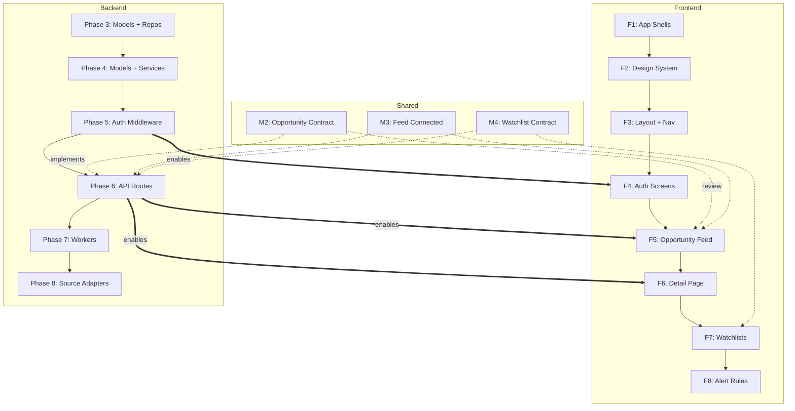

# ChronoArb — Frontend–Backend Workstream Separation & Phased Execution

**Document type:** Parallel development coordination agreement
**Date:** 2026-08-03T22:35:47+05:00
**From:** Lead Software Architect
**To:** Both Developers
**Status:** Current

---

## 1. Purpose

ChronoArb is now being developed in parallel by two developers:

| Developer | Owns |
|-----------|------|
| **Existing Developer** | Frontend workstream: Next.js web, Flutter mobile, design system, API client integration |
| **New Backend Developer** | Backend workstream: FastAPI, workers, ORM, migrations, source adapters, domain logic |

This document answers five questions for every engineering day:

1. **What should I work on now?**
2. **What should the other developer work on now?**
3. **What should I not touch?**
4. **When do we need to coordinate?**
5. **What must be completed before the next phase begins?**

### Shared Rules

| Rule | Reasoning |
|------|-----------|
| `main` is the shared stable integration branch | Single source of truth |
| Both developers use short-lived feature branches | No permanent branches |
| Neither developer works outside their assigned phase without coordination | Prevents duplicate work |
| Shared contracts and cross-cutting architecture require agreement | Prevents silent divergence |
| AGENTS.md is the highest project authority | Overrides this document if they conflict |

---

## 2. Verified Starting Baseline

All values confirmed against the repository on 2026-08-03T22:35:47+05:00.

| Check | Value | Source |
|-------|-------|--------|
| Architecture foundation | Complete | `docs/architecture/*.md` — all 7 documents |
| Repository foundation | Complete | Monorepo tooling operational |
| Backend foundation | Complete | FastAPI serves `/health`, `/ready` |
| Database foundation | Complete | 25 tables, 7 ENUMs, 12 indexes |
| Week 2 Phase 1 | **Closed** | `docs/reviews/week-02-phase-01-closure.md` |
| Week 2 Phase 2 | **Closed** | `docs/reviews/week-02-phase-02-review.md` |
| Backend Phase 3 | **Next — not started** | `docs/implementation/week-02-domain-plan.md` |
| Frontend | **Not started — zero files exist** | `apps/web/`, `apps/mobile/` do not exist |
| PostgreSQL tables | 25 | `\dt` |
| ENUM types | 7 | `SELECT * FROM pg_type WHERE typtype='e'` |
| Application indexes | 12 | `\di idx_*` |
| Alembic migrations | 4 | `alembic/versions/` — 4 files |
| Migration head | `f2b39ba97b17` | `alembic_version` table |
| API tests | 57 | `pytest apps/api/tests/ --collect-only` |
| Domain tests | 33 | `pytest packages/domain-python/tests/ --collect-only` |
| **Total tests** | **90** | Both suites |
| Git branch | `main` | `git branch --show-current` |
| Frontend directories | **None exist** | `apps/web/`, `apps/mobile/`, `packages/design-tokens/`, `packages/api-client-ts/` — all absent |

---

## 3. Ownership Principles

### Frontend Owner

| Primary Responsibility | Examples |
|------------------------|----------|
| Frontend application structure | `apps/web/`, `apps/mobile/` scaffolding |
| Pages and layouts | App Router pages, Flutter screens |
| UI components | Feature components, design system primitives |
| Design system | CSS variables, Tailwind config, theme tokens in `packages/design-tokens/` |
| Responsive behavior | Mobile-first, breakpoint handling |
| Frontend routing | Next.js App Router, Flutter go_router |
| Frontend state management | TanStack Query, React Context, Riverpod |
| Frontend authentication flow | OIDC callback, token management, session handling |
| API client integration | Generated client, request interceptors, error handling |
| Loading/empty/success/error states | Every async screen implements all four states |
| Frontend tests | Vitest, Testing Library, Playwright, Flutter tests |
| Accessibility (WCAG 2.2 AA) | Keyboard nav, screen reader, semantic HTML |
| Frontend performance | Code splitting, image optimization, virtualized lists |

### Backend Owner

| Primary Responsibility | Examples |
|------------------------|----------|
| ORM models | SQLAlchemy `Mapped[]` annotations matching migrations |
| Infrastructure repositories | `BaseRepository`, `TenantRepository` implementations |
| Application services | Use-case orchestration, transaction management |
| Domain rules | Pure business logic, value objects, policies |
| Unit of Work | Session management, commit/rollback, repository factory |
| API routes | FastAPI endpoints, input validation |
| Pydantic schemas | Request/response DTOs, `snake_case`, `from_attributes` |
| Authentication enforcement | JWT validation middleware, role checks |
| Tenant isolation | Mandatory `organization_id` on every scoped query |
| Workers | Pipeline stages: discovery → fetch → parse → normalize → value → match → notify |
| Source adapters | Source-specific fetch/parse implementations |
| Ingestion pipeline | Queue topology, idempotency, DLQ management |
| Valuation logic | Comparable-based estimation, Decimal arithmetic |
| Opportunity logic | Scoring, material versioning, alert matching |
| Alerts | Rule evaluation, cooldown, channel routing |
| Outbox processing | Transactional event publishing to SQS |
| Alembic migrations | Hand-written DDL, expand/contract pattern |
| Backend tests | pytest, tenant isolation tests, PostgreSQL parity tests |
| OpenAPI documentation | Generated from Pydantic schemas |

### Shared Responsibility — Coordinate Before Changing

| Area | Reason |
|------|--------|
| API contracts | Both developers must agree before implementation diverges |
| Authentication/session behavior | Affects both API enforcement and frontend token management |
| Pagination format | Cursor-based, `next_cursor` field, limit semantics |
| Error response format | `{ code, message, field_errors, trace_id, retryable }` envelope |
| Shared types or generated clients | TypeScript and Dart clients generated from OpenAPI |
| Root workspace configuration | `package.json`, `pyproject.toml`, `turbo.json`, `pnpm-workspace.yaml` |
| Environment variable names | `CHRONOARB_*` prefix convention |
| Database schema changes | New tables, columns, constraints affect both layers |
| Breaking API changes | Response shape changes break frontend clients |
| Deployment configuration | Terraform, Dockerfiles, CI workflows |
| Cross-cutting ADR changes | Architecture decisions affect both workstreams |

---

## 4. Repository Path Ownership

| Path | Primary Owner | Other May Modify? | Approval Required? | Notes |
|------|-------------|-------------------|--------------------|-------|
| `apps/web/` | **Frontend** | No | No | Does not exist yet — frontend creates from scratch |
| `apps/mobile/` | **Frontend** | No | No | Does not exist yet |
| `packages/design-tokens/` | **Frontend** | No | No | Does not exist yet |
| `packages/api-client-ts/` | **Frontend** | No | No | Generated from OpenAPI — shared contract source |
| `packages/api-client-dart/` | **Frontend** | No | No | Does not exist yet |
| `apps/api/apps/api/**/infrastructure/` | **Backend** | No | No | ORM models, repositories |
| `apps/api/apps/api/**/application/` | **Backend** | No | No | Services, commands |
| `apps/api/apps/api/**/domain/` | **Backend** | No | No | Pure business rules |
| `apps/api/apps/api/**/api/` | **Backend** | Yes (read) | No | Frontend reads schemas for contract understanding |
| `apps/api/apps/api/main.py` | **Backend** | No | No | FastAPI entry point |
| `apps/api/apps/api/settings.py` | **Backend** | Yes (read) | No | Frontend reads env var names |
| `apps/api/tests/` | **Backend** | No | No | Backend test suite |
| `apps/worker/` | **Backend** | No | No | Worker skeleton exists, pipeline code pending |
| `packages/domain-python/` | **Backend** | Yes (read) | No | Frontend reads domain types for contract understanding |
| `packages/source-adapters/` | **Backend** | No | No | Source-specific adapters |
| `alembic/` | **Backend** | No | Yes | Migration files — frontend should never modify |
| `docs/architecture/api-design.md` | **Shared** | Yes | Yes | Contract change requires review |
| `docs/architecture/frontend-design.md` | **Frontend** | Yes | Yes | Frontend architecture |
| `docs/architecture/database-design.md` | **Backend** | Yes | Yes | Schema changes require review |
| `docs/architecture/security-model.md` | **Shared** | Yes | Yes | Security changes require both |
| `docs/adr/` | **Backend** | Yes | Yes | New ADRs need both signatures |
| `pyproject.toml` | **Shared** | Yes | Yes | Python tooling config |
| `package.json` | **Shared** | Yes | Yes | Root scripts |
| `turbo.json` | **Shared** | Yes | Yes | Pipeline stages |
| `pnpm-workspace.yaml` | **Shared** | Yes | Yes | Workspace members |
| `.importlinter` | **Backend** | Yes | Yes | Python boundary enforcement |
| `Makefile` | **Backend** | Yes | Yes | DB commands — frontend reads for setup |
| `.github/workflows/` | **Shared** | Yes | Yes | CI pipeline |
| `.env.example` | **Shared** | Yes | Yes | Does not exist yet — create together |
| `docker/` | **Shared** | Yes | Yes | Infrastructure |

---

## 5. Backend Phased Roadmap

### Completed Phases

| Phase | Status | Deliverables |
|-------|--------|-------------|
| Architecture Foundation | Complete | System design, database design, API contract, security model, ADRs |
| Repository Foundation | Complete | Monorepo, pnpm, turbo, toolchain configs |
| Backend Foundation | Complete | FastAPI shell, health/ready, trace ID, Money domain objects |
| Database Foundation | Complete | 25 tables, 7 ENUMs, 12 indexes, 4 migrations |
| Week 2 Phase 1 | **Closed** | BaseRepository, TenantRepository, UnitOfWork, identity models |
| Week 2 Phase 2 | **Closed** | Catalog models, 8 repositories, 8 Pydantic schemas, 90 tests |

### Phase 3 — Next Approved Backend Work

**Status: NOT STARTED**
**Source:** `docs/implementation/week-02-domain-plan.md` §9 (Days 3-4)

| Attribute | Value |
|-----------|-------|
| **Models** | RawSnapshot, ParsedListing, NormalizedListing, DuplicateGroup, DuplicateGroupMember, Valuation, Opportunity, OpportunityView (8 models) |
| **Repositories** | ListingRepository, DuplicateRepository, ValuationRepository, OpportunityRepository (4 repos) |
| **Schemas** | Listing/valuation/opportunity response schemas |
| **Services** | None in Phase 3 |
| **API Routes** | None in Phase 3 |
| **Worker Code** | None in Phase 3 |
| **Tests** | Model parity, repository CRUD, tenant isolation, PostgreSQL dialect compilation |
| **Files** | `listings/infrastructure/models.py`, `valuation/infrastructure/models.py`, `listings/infrastructure/repositories.py`, `valuation/infrastructure/repositories.py`, `listings/api/schemas.py`, `valuation/api/schemas.py`, `opportunities/api/schemas.py` |
| **Exclusions** | Application services, API routes, alert/feedback/billing/operations models, worker pipeline, cursor pagination (included) |
| **Review Gate** | Migration 002 ORM parity, tenant isolation, all 57+ API tests continue to pass |

### Phase 4 — Proposed Sequencing (Requires Approval)

**Status: PLANNED — not approved for implementation**
**Source:** `docs/implementation/week-02-domain-plan.md` §9 (Day 4 remainder + Day 5)

| Attribute | Value |
|-----------|-------|
| **Models** | AlertRule, AlertDelivery, Feedback, TradeOutcome, Subscription, AuditEvent, OutboxEvent, FeatureFlag (8 models from Migration 003) |
| **Repositories** | AlertRuleRepository, AlertDeliveryRepository, FeedbackRepository, TradeOutcomeRepository, SubscriptionRepository, AuditEventRepository, OutboxEventRepository, FeatureFlagRepository |
| **Services** | OrganizationService, MembershipService, CatalogService, WatchListService, OpportunityFeedService, AlertRuleService |
| **API Routes** | None (Week 3-5) |
| **Worker Code** | None |

### Phase 5+ — Proposed Sequencing (Requires Approval)

| Phase | Scope | Source |
|-------|-------|--------|
| Phase 5 | Authentication middleware, Cognito integration | `docs/architecture/security-model.md` |
| Phase 6 | API routes (opportunity feed, detail, feedback, catalog, settings) | `docs/architecture/api-design.md` §3 |
| Phase 7 | Worker pipeline (discovery, fetch, parse, normalize, value, match, notify) | `docs/architecture/worker-design.md` |
| Phase 8 | Source adapters (3 approved sources) | `docs/architecture/worker-design.md` |
| Phase 9 | Billing integration (Stripe) | Week 13 roadmap |
| Phase 10+ | Hardening, performance, security | Week 15-16 roadmap |

---

## 6. Frontend Phased Roadmap

**Current state:** Frontend implementation has not started. No files, directories, or packages exist under `apps/web/`, `apps/mobile/`, `packages/design-tokens/`, or `packages/api-client-ts/`. This roadmap is proposed based on `docs/architecture/frontend-design.md` and requires approval before implementation begins.

### Phase F1 — Frontend Foundation (Proposed)

| Attribute | Value |
|-----------|-------|
| **Status** | PROPOSED — requires approval |
| **Scope** | Next.js app shell with blank placeholder page; Flutter app shell with blank placeholder; design-tokens package with placeholder palette; TypeScript and Dart API client packages |
| **Backend Dependency** | None — blank shells with no API calls |
| **Mocking Allowed?** | Not applicable — no data displayed |
| **Files** | `apps/web/app/layout.tsx`, `apps/web/app/page.tsx`, `apps/web/next.config.ts`, `apps/web/tailwind.config.ts`, `apps/mobile/lib/main.dart`, `packages/design-tokens/tokens/colors.ts`, `packages/api-client-ts/src/index.ts` |
| **Exclusions** | Login, authentication, dashboard, API calls, real data |

### Phase F2 — Design System (Proposed)

| Attribute | Value |
|-----------|-------|
| **Status** | PROPOSED — requires approval |
| **Scope** | Design system primitives: color tokens, typography, spacing, shadows, buttons, inputs, cards, error states |
| **Backend Dependency** | None — purely visual |
| **Mocking Allowed?** | Not applicable — no data displayed |
| **Exclusions** | Feature-specific components, API integration |

### Phase F3 — Application Shell (Proposed)

| Attribute | Value |
|-----------|-------|
| **Status** | PROPOSED — requires approval |
| **Scope** | Dashboard layout with sidebar, navigation, organization context, placeholder pages |
| **Backend Dependency** | None — can use hardcoded org name |
| **Mocking Allowed?** | Not applicable — static shell |
| **Exclusions** | Real data, authentication, API calls |

### Phase F4 — Authentication Screens (Proposed)

| Attribute | Value |
|-----------|-------|
| **Status** | PROPOSED — requires approval |
| **Scope** | Login page, OIDC callback route, session management, token refresh |
| **Backend Dependency** | **BLOCKS** — requires Cognito User Pool configured and authentication contract agreed |
| **Mocking Allowed?** | Yes — mock OIDC provider during development |
| **Exclusions** | Real Cognito integration until contract agreed |

### Phase F5 — Opportunity Feed (Proposed)

| Attribute | Value |
|-----------|-------|
| **Status** | PROPOSED — requires approval |
| **Scope** | Opportunity feed page with filters, sorting, cursor-based pagination, skeleton loading, error states |
| **Backend Dependency** | **BLOCKS** — requires `/api/v1/opportunities` endpoint implemented or mock contract agreed |
| **Mocking Allowed?** | Yes — approved mock response schema |
| **Exclusions** | Real-time WebSocket updates, notification center |

### Phase F6+ — Proposed Sequencing

| Phase | Scope | Backend Dependency |
|-------|-------|--------------------|
| F6 | Opportunity detail page | Requires `/api/v1/opportunities/{id}` |
| F7 | Watchlists (references, price history) | Requires `/api/v1/catalog/references`, `/api/v1/catalog/watch-lists` |
| F8 | Alert rules (CRUD UI) | Requires `/api/v1/alerts/rules` |
| F9 | Activity feed (feedback, outcomes) | Requires `/api/v1/activity` |
| F10 | Settings (org, integrations, billing) | Requires `/api/v1/settings`, `/api/v1/billing` |
| F11 | Accessibility audit (WCAG 2.2 AA) | None — audit-only |
| F12 | Responsive review and hardening | None |

---

## 7. Parallel Work Matrix

| Time Block | Frontend Owner Focus | Backend Owner Focus | Shared Coordination | Merge Dependency |
|------------|---------------------|---------------------|--------------------|------------------|
| **Now** | F1: Frontend foundation (blank shells) | Phase 3: Listing + valuation ORM models | None — both are independent | None — different directories |
| **Now** | F2: Design system primitives | Phase 3: Listing + valuation repositories | None — independent | None |
| **After Phase 3** | F3: Application shell (static layout) | Phase 4: Alert + operations models | None — independent | None |
| **After Phase 4** | F4: Authentication screens | Phase 4: Services | **Auth contract must be agreed** | Cognito pool config, JWT format |
| **After auth contract** | F5: Opportunity feed (mocked) | Phase 6: `/api/v1/opportunities` endpoint | **Response contract must be agreed first** | Backend endpoint, Pydantic schema |
| **After feed contract** | F5: Switch mock → real API | Phase 6: Continue endpoints | Integration testing | Both branches merge to main |
| **Parallel** | F6-F9: Feature pages | Phase 6: Additional endpoints | Contracts agreed per-page | Per-feature merges |
| **Parallel** | F11: Accessibility audit | Phase 7: Worker pipeline | None — independent | None |
| **Final** | F12: Responsive hardening | Phase 10: Performance tuning | E2E integration tests | Both complete → MVP gate |

---

## 8. Current Immediate Assignments

### Backend Developer — Work to Start Now

```
Task:     Phase 3, Task 1 — Listing ORM Models
Scope:    RawSnapshot, ParsedListing, NormalizedListing models
Branch:   feat/backend-phase-3-listing-models
Prerequisites:
  - Read AGENTS.md
  - Read alembic/versions/12e1f9e711d2_002_listings_and_valuation.py
  - Read docs/architecture/database-design.md §2.3-2.4
  - Read docs/adr/0004-customer-visible-data-freshness-model.md
  - Read docs/adr/0005-fx-rate-management.md
Files:    apps/api/apps/api/listings/infrastructure/models.py (new)
          apps/api/tests/test_listing_models.py (new)
Tests:    ORM parity vs Migration 002, JSONB variant compilation, FK enforcement
Exclusions: DuplicateGroup, DuplicateGroupMember, Valuation, Opportunity models
           Repositories, services, API routes
Evidence: 90 existing tests pass + new tests pass
```

### Frontend Developer — Work to Start Now

```
Task:     Frontend Foundation — Next.js + Flutter blank shells
Scope:    Minimal Next.js app with placeholder page, minimal Flutter app
Branch:   feat/frontend-foundation
Prerequisites:
  - Read AGENTS.md
  - Read docs/architecture/frontend-design.md
  - Read docs/architecture/api-design.md (for understanding contracts)
Files:    apps/web/
          apps/mobile/
          packages/design-tokens/
          packages/api-client-ts/
Mock Data: Not applicable — no data displayed
Contract: Not applicable — no API calls
Tests:    Next.js compiles, Flutter build succeeds
Exclusions: Login, authentication, dashboard, API calls, real data, opportunity feed
Evidence: pnpm run dev serves blank page, flutter build apk --debug succeeds
```

---

## 9. "My Focus / Not My Focus" Tables

### Frontend Owner

| My Focus | Not My Focus | Coordinate Before Touching |
|----------|-------------|---------------------------|
| `apps/web/app/` pages and layouts | `apps/api/apps/api/` (backend modules) | `docs/architecture/api-design.md` (API contract changes) |
| `apps/web/components/` UI components | `alembic/versions/` (migrations) | `docs/architecture/security-model.md` (auth behavior) |
| `packages/design-tokens/` styling | `apps/worker/` (worker code) | `pyproject.toml` (Python tooling) |
| `packages/api-client-ts/` (generated client) | `packages/domain-python/` (domain logic) | Environment variable names |
| Frontend routing, state management | PostgreSQL, SQLAlchemy | Shared CI workflow changes |
| WCAG 2.2 AA accessibility | Repository implementations | Response envelope shape |
| Loading/error/empty/success states | Valuation formulas | Pagination format |
| Tailwind CSS, responsive design | Source adapter code | Error response codes |
| TanStack Query hooks | Alembic DDL | Authentication flow |

### Backend Owner

| My Focus | Not My Focus | Coordinate Before Touching |
|----------|-------------|---------------------------|
| `apps/api/apps/api/**/infrastructure/models.py` | `apps/web/` (Next.js pages) | `docs/architecture/api-design.md` (API contract) |
| `apps/api/apps/api/**/infrastructure/repositories.py` | `apps/mobile/` (Flutter screens) | `docs/architecture/frontend-design.md` (contract impact) |
| `apps/api/apps/api/**/application/services.py` | `packages/design-tokens/` (styling) | Response schema shape changes |
| `apps/api/apps/api/**/api/schemas.py` | Frontend routing, components | Authentication/session behavior |
| `apps/api/apps/api/**/api/` routes | Tailwind CSS config | Breaking endpoint changes |
| `alembic/versions/` (migrations) | TanStack Query hooks | New table or column additions |
| `apps/worker/` (pipeline code) | Flutter state management | Shared `pyproject.toml`, `turbo.json` |
| `packages/domain-python/` domain logic | WCAG accessibility | Environment variable naming |
| `packages/source-adapters/` source code | Loading state UI design | Root workspace config |

---

## 10. Backend–Frontend Contract Workflow

### Endpoint Lifecycle

```
1. Backend proposes contract            → Draft Pydantic schemas, OpenAPI fragment
2. Both developers review               → Check request/response shape, error format
3. Contract documented                   → docs/architecture/api-design.md §4
4. Frontend creates or updates mocks     → Mock Service Worker, hardcoded JSON fixtures
5. Backend implements endpoint           → Route handler, service, repo → tests
6. Backend publishes verification        → curl examples, test evidence, OpenAPI output
7. Frontend replaces mock with real call  → Switch TanStack Query from mock to real endpoint
8. Integration test completed             → E2E test verifies full chain
9. Contract considered stable             → Mark as STABLE in api-design.md
```

### Contract Document Location

Append to `docs/architecture/api-design.md` §4 (API Route Map). This document is the shared canonical source for API contracts. When adding an endpoint, update the route map table with:

- HTTP method
- Route path
- Authentication required?
- Tenant scope
- Request schema reference
- Response schema reference
- Error responses
- Pagination format

### Required Per-Endpoint Information

```markdown
## GET /api/v1/opportunities
- Auth: Bearer JWT
- Tenant: Scoped to authenticated user's organization_id
- Query: cursor, limit, sort
- Response (200): Opportunity[] with meta.next_cursor
- Errors: 401 (Unauthorized), 422 (Validation)
- Pagination: Cursor-based, published_at DESC
```

---

## 11. Dependency and Blocking Rules

### Frontend Must Wait When

- The API contract for a feature has not been agreed
- Authentication behavior is unresolved (token format, refresh flow, session expiry)
- A real integration depends on an endpoint that doesn't exist and can't be mocked
- A shared schema or type is being changed

### Frontend Does NOT Need to Wait When

- Building layouts, headers, sidebars, navigation (static components)
- Creating reusable UI primitives (buttons, inputs, cards, modals)
- Implementing responsive behavior (Tailwind breakpoints, mobile-first)
- Using approved mock payloads that match the documented contract
- Writing UI unit tests, component tests, accessibility checks
- Building Flutter screens with Riverpod providers using mock data sources

### Backend Must Wait When

- A response shape affects active frontend work and hasn't been reviewed by the frontend owner
- A migration changes data that frontend already consumes
- Authentication or tenant behavior requires architectural approval (ADR change)
- A shared root configuration change could break frontend tooling

### Backend Does NOT Need to Wait When

- Implementing ORM models that match Migration DDL (no contract impact)
- Implementing repositories for existing tables (no API contract impact)
- Adding backend-only tests (no frontend dependency)
- Refactoring internal service logic without changing contract boundaries
- Writing outbox workers (internal infrastructure, no API surface)
- Adding PostgreSQL-specific dialect compilation tests

---

## 12. Shared Milestones

| ID | Milestone | Status | Frontend | Backend | Integration Test | Exit Criteria |
|----|-----------|--------|----------|---------|------------------|---------------|
| M0 | Baseline | **COMPLETE** | — | Phase 2 closed | — | 90 tests pass, migration head matches |
| M1 | Frontend shell + Backend Phase 3 | **PROPOSED** | F1: blank Next.js + Flutter apps | Phase 3: listing + valuation ORM models | None — independent work | Frontend compiles, backend models match Migration 002 |
| M2 | Opportunity API contract | **PROPOSED** | F5 mock opportunity feed | `/api/v1/opportunities` schema defined | Contract document in `api-design.md` | Both developers sign off on response shape |
| M3 | Opportunity feed connected | **PROPOSED** | F5: replace mock with real API | Phase 6: `/api/v1/opportunities` endpoint | E2E: API → frontend → display | Feed page loads real opportunities |
| M4 | Watchlist workflow | **PROPOSED** | F7: watchlist UI | Phase 6: `/api/v1/catalog/watch-lists` | E2E: create list, add entry, view | Full CRUD flow |
| M5 | Alerts connected | **PROPOSED** | F8: alert rule builder | Phase 6: `/api/v1/alerts/rules` + worker | E2E: create rule → match → notify | Alert delivered to frontend |
| M6 | MVP verification | **PROPOSED** | All feature pages complete | All Phase 6 endpoints + workers | Full E2E suite | All MVP gate criteria met |

---

## 13. Branch Strategy

### Rules

- No direct commits to `main`
- No permanent `frontend` or `backend` branches
- One short-lived branch per bounded task
- Branches start from latest `main`
- Pull request required for every merge
- Squash merge only
- Delete branch after merge
- No force pushes to `main`

### Branch Naming

| Workstream | Pattern | Example |
|-----------|---------|---------|
| Frontend | `feat/frontend-{description}` | `feat/frontend-app-shell` |
| Frontend fix | `fix/frontend-{description}` | `fix/frontend-responsive-layout` |
| Frontend test | `test/frontend-{description}` | `test/frontend-opportunity-card` |
| Backend | `feat/backend-phase-{n}-{task}` | `feat/backend-phase-3-listing-models` |
| Backend fix | `fix/backend-{description}` | `fix/backend-tenant-query` |
| Backend test | `test/backend-{description}` | `test/backend-postgres-parity` |
| Shared | `docs/{description}` or `chore/{description}` | `docs/api-opportunity-contract` |

Shared branches still require agreement from both developers before changes begin.

---

## 14. Pull Request Ownership

### Backend PR

| Author | Must Review | When |
|--------|-------------|------|
| Backend developer | Backend developer (self-review) | Always |
| Backend developer | **Frontend owner** | API contract changes, authentication changes, migrations, tenant behavior changes, shared config changes |

### Frontend PR

| Author | Must Review | When |
|--------|-------------|------|
| Frontend developer | Frontend developer (self-review) | Always |
| Frontend developer | **Backend developer** | API contract assumptions, auth handling, generated client changes, shared types, backend env var changes |

### PR Description Template

```markdown
## Objective
<one-sentence summary>

## Files Changed
- path: reason

## Tests
| Suite | Before | After |
|-------|--------|-------|
| API | XX | XX |
| Domain | XX | XX |
| Frontend | XX | XX |

## Contract Impact
<None / New endpoint / Response change / Schema change>

## Database Impact
<None / New migration / Schema change>

## Tenant Isolation
<Verified / Not applicable>

## Screenshots
<Frontend only — attach screenshots of UI changes>

## Risks
<Explicit or none>

## Status
READY FOR REVIEW / DRAFT
```

---

## 15. Change-Control Matrix

| Change Type | Frontend Can Decide Alone? | Backend Can Decide Alone? | Joint Approval Required? |
|-------------|---------------------------|--------------------------|-------------------------|
| UI styling (Tailwind config, theme) | **Yes** | — | No |
| Component organization | **Yes** | — | No |
| Frontend routing | **Yes** | — | No |
| ORM model mapping | — | **Yes** | No |
| Repository implementation | — | **Yes** | No |
| Internal service refactoring | — | **Yes** | No |
| Adding a new endpoint | — | No | **Yes — contract review** |
| Changing response shape | No | No | **Yes — frontend breaks** |
| Changing error response format | No | No | **Yes — shared contract** |
| Authentication/session handling | No | No | **Yes — both layers affected** |
| Database migration | — | No | **Yes — schema change** |
| Tenant isolation rules | No | No | **Yes — security boundary** |
| Environment variables | No | No | **Yes — shared naming** |
| CI workflow | No | No | **Yes — shared pipeline** |
| ADR modification | No | No | **Yes — architecture governance** |
| Deployment configuration | No | No | **Yes — infrastructure** |
| Generated API client type | **Yes** | **Yes** (backend owns source of truth) | No — generated from OpenAPI |
| Adding a new package | No | No | **Yes — workspace change** |

---

## 16. Conflict Prevention Rules

1. Do not edit another developer's active files without discussion.
2. Announce shared-file changes in the daily handoff before beginning.
3. Do not mix frontend and backend implementation in one pull request.
4. Do not change an agreed contract silently — update `api-design.md` and notify.
5. Do not start later phases early.
6. Do not perform unrelated cleanup in feature branches.
7. Do not rename shared types or env variables without coordination.
8. Rebase or update from `main` before opening a pull request.
9. Resolve merge conflicts with the owner of the affected area.
10. Keep pull requests small — one bounded task per PR.

---

## 17. Communication Format

### Daily Handoff

```
Owner: [frontend | backend]
Branch: feat/phase-3-listing-models
Current bounded task: Implement RawSnapshot, ParsedListing, NormalizedListing ORM models
Completed: RawSnapshot, ParsedListing models with JSONB variants and FK constraints
Files changed: apps/api/apps/api/listings/infrastructure/models.py (new)
Tests: 93 (90 existing + 3 new — all pass)
Contract impact: None
Database impact: None
Blocked by: None
Needs review from: None (no contract changes)
Next step: NormalizedListing model with ADR-0004/0005 columns
```

### Contract Change Alert

```
Proposed change: Add `data_age_seconds` field to OpportunityResponse
Reason: AGENTS.md §2 requires data age in customer-visible estimates
Affected endpoint: GET /api/v1/opportunities/{id}
Frontend impact: New field to display — "Listed 3 hours ago"
Backend impact: Computed from observation_at, no DB change
Breaking? No — additive field, existing clients ignore unknown fields
Decision required by: Before Phase 6 endpoint implementation
```

---

## 18. Definition of Done by Workstream

### Frontend Task Complete When

- [ ] Scope matches assigned phase — no extra screens or features
- [ ] Responsive UI implemented (mobile + desktop breakpoints)
- [ ] Loading, error, empty, and success states all covered
- [ ] Accessibility checked (keyboard nav, screen reader, semantic HTML)
- [ ] Mock data or real API conforms to documented contract
- [ ] Frontend tests pass
- [ ] Screenshots or visual evidence included in PR
- [ ] No backend files changed
- [ ] Pull request approved by backend developer (if contract-impacting)

### Backend Task Complete When

- [ ] Scope matches approved phase — no extra models, services, or endpoints
- [ ] Architecture boundaries preserved — models in infrastructure, no domain-layer SQLAlchemy
- [ ] Migration parity proven — every column matches Migration DDL
- [ ] Tenant isolation tested — cross-tenant returns None
- [ ] Focused tests pass
- [ ] Full API test suite passes (57+ tests)
- [ ] Full domain test suite passes (33 tests)
- [ ] API contract documented in `api-design.md` (if applicable)
- [ ] PostgreSQL-specific behavior validated (dialect compilation tests)
- [ ] No frontend files changed
- [ ] Pull request approved by frontend owner (if contract-impacting)
- [ ] Closure verdict recorded (if phase gate)

---

## 19. Escalation Rules

Both developers must **stop and discuss** before:

- Creating an unplanned migration
- Changing an ADR
- Changing authentication flow or token handling
- Changing tenant isolation rules
- Introducing a new framework, library, or external dependency
- Altering an agreed API response shape or error format
- Modifying shared package architecture (domain-python interfaces, repository base classes)
- Changing deployment strategy (Terraform, Dockerfiles)
- Beginning a later phase before the current phase completes
- Bypassing legal source-access restrictions
- Changing security-sensitive behavior (secrets management, JWT validation, CORS)
- Modifying `AGENTS.md` or its authority order

---

## 20. Visual Roadmap



**Legend:** Solid arrows = hard dependency (must complete before other can integrate). Dotted arrows = coordination point (contract agreement). Double line = both workstreams integrate at this point.

---

## 21. Master Responsibility Table

| Phase/Task | Owner | Status | Branch | Depends On | Must Not Include | Review By | Exit Evidence |
|-----------|-------|--------|--------|------------|------------------|-----------|---------------|
| Backend Phase 2 | Backend | **CLOSED** | — | — | — | Both | 90 tests, migration parity |
| Backend Phase 3 | Backend | **NOT STARTED** | `feat/backend-phase-3-listing-models` | Nothing | Services, API routes, worker code | Frontend (contract only) | 8 models match Migration 002 |
| Frontend F1 | Frontend | **PROPOSED** | `feat/frontend-foundation` | Nothing | API calls, authentication, real data | Backend (config only) | Next.js + Flutter compile |
| Frontend F2 | Frontend | **PROPOSED** | `feat/frontend-design-system` | F1 | Feature components, API | Backend (none) | Design tokens package builds |
| M2 Opportunity Contract | Shared | **PROPOSED** | `docs/api-opportunity-contract` | Backend Phase 3 | Implementation code | Both | Contract documented |
| M3 Feed Connected | Shared | **PROPOSED** | — | F5 + B6 | — | Both | E2E test passes |

---

## 22. Quick Reference

### Frontend Owner

| Question | Answer |
|----------|--------|
| Current focus | F1: Frontend foundation — Next.js + Flutter blank shells |
| Next branch | `feat/frontend-foundation` |
| Do not touch | `apps/api/`, `alembic/`, `apps/worker/`, `packages/domain-python/`, `packages/source-adapters/` |
| Waiting on | Nothing — can start immediately |
| Shared decision required | None at this stage — frontend foundation has no API dependencies |

### Backend Owner

| Question | Answer |
|----------|--------|
| Current focus | Phase 3, Task 1 — Listing ORM models (RawSnapshot, ParsedListing, NormalizedListing) |
| Next branch | `feat/backend-phase-3-listing-models` |
| Do not touch | `apps/web/`, `apps/mobile/`, `packages/design-tokens/`, frontend source |
| Waiting on | Nothing — can start immediately |
| Shared decision required | None at this stage — ORM models have no API contract impact |

### Shared Baseline

| Metric | Value |
|--------|-------|
| Main branch | `main` |
| Baseline tag | `week2-phase2-closed` |
| Migration head | `f2b39ba97b17` |
| Test count | 90 (57 API + 33 domain) |
| Current backend phase | Phase 2 — CLOSED |
| Next backend phase | Phase 3 — NOT STARTED |
| Current frontend phase | NOT STARTED |
| Next frontend phase | F1 — PROPOSED |
| Next integration milestone | M2 — Opportunity API contract |


## Appendix A: Document Creation Verification

All values confirmed against the repository on 2026-08-03T22:35:47+05:00.

| Check | Method | Result |
|-------|--------|--------|
| Backend Phase 3 scope | `week-02-domain-plan.md` §9 | Days 3-4 extracted — 8 models, 4 repos |
| Frontend implementation status | `find apps/web apps/mobile` — both absent | Zero files — confirmed not started |
| Design tokens status | `find packages/design-tokens` — absent | Zero files |
| API client status | `find packages/api-client-ts` — absent | Zero files |
| Migration head | `alembic_version` table | `f2b39ba97b17` |
| Test count | `pytest --collect-only` × 2 | 57 API + 33 domain = 90 |
| No overlapping task assignments | Manual verification | Each task assigned to single owner |
| No permanent branches | Policy: delete after merge | Enforced via branch strategy section |
| AGENTS.md authority preserved | Document explicitly defers | §1 last row, §19 escalation rules |
| All referenced paths exist | `test -f` for 20+ paths | All present |
